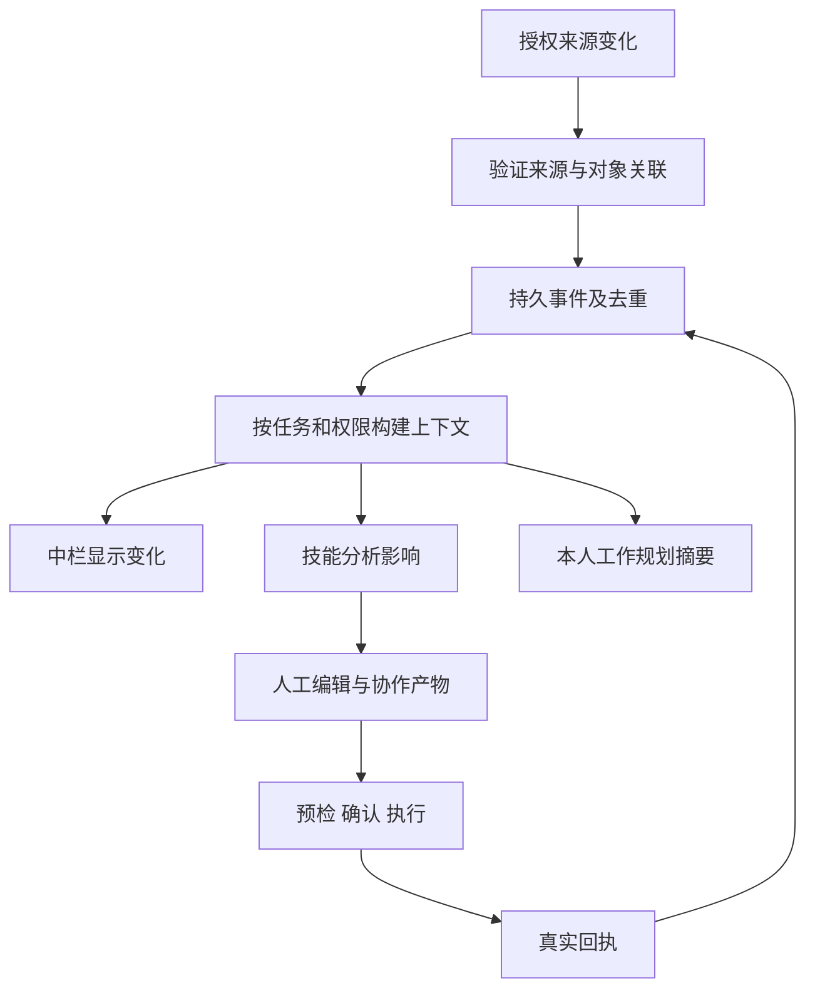

# 任务协作工作台：产品设计文档

| 项目 | 内容 |
|---|---|
| 文档 ID | PRD-TCW-2026-10-04 |
| 版本 / 日期 | v1.0 / 2026-10-04 |
| 状态 | 产品设计稿；P1 实施中，P2–P5 未开始；[P1 实施与证据](task-collaboration-workbench-p1-evidence.md)；不是生产完成证明 |
| 产品名称 | 任务协作工作台；员工继续使用现有工作台，不新增一级导航 |
| 需求来源 | 本次对话：AI发现回归诊断、中栏实时上下文、与工作规划智能体的分工、每期闭环交付 |
| 实现核对基线 | 仓库 `248764c`；线上诊断事实沿用本次对话前序只读检查，不表示本文编写时重新验证生产 |
| 配套计划 | [Phase 交付与验收计划](task-collaboration-workbench-phases.md) |
| 层级 | 产品实施设计，受宪法及三部基本法约束；不修改现行授权、业务期限或视觉 token |

## 1. 产品定义与预期结果

任务协作工作台是员工和 Agent 围绕一件工作，共享最新信息、讨论下一步、形成产物并完成受控提交的地方。中栏承担人机协作，右栏承担当前产物、结果明细及提交结果。实时上下文是工作台的支撑能力，不另建一个需要员工维护的“上下文中心”。

核心承诺：员工看到的信息、Agent 本轮判断所引用的事实、提交时被校验的依据，能够对应到同一个有来源、有版本的任务上下文。三者允许因处理耗时存在时间差，但必须明确显示差异，不能把旧分析标成基于最新事实。

产品假设：如果同一任务能够恢复工作现场，并把影响当前动作的新事实及时呈现和复核，员工将减少重复输入、重复核对、遗漏变化和基于过期条件的错误提交。业务收益待试点测量，不虚构当前完成率、节省工时或经济回报。

### 1.1 用户与工作目标

| 用户 | 工作目标 | 当前痛点 | 产品提供的结果 |
|---|---|---|---|
| KOL 执行员工 | 完成发现、沟通、跟进和履约任务 | 信息散落、角色切换后丢条件、新回复未进入草稿 | 一件任务连续处理，重要变化可见，产物可修订 |
| 工单受理人 / 协同人 | 了解依赖、处理阻塞、交付工单 | 审批和其他工单变化未反映到当前工作 | 关联变化进入当前工单，责任与下一步明确 |
| 负责人 | 识别风险与优先工作 | 工作规划读取的摘要与实际状态不同步 | 有证据的优先级、阻塞原因和任务入口 |
| 审批人 | 对明确对象、内容与版本作决定 | 旧审批被误用于已修改内容 | 审批与内容版本绑定，结果只影响覆盖动作 |
| 管理与支持人员 | 定位未启动、失败、未知结果 | 聊天回答、执行状态与回执混淆 | 可追溯到任务、上下文版本、动作和真实回执 |

### 1.2 需求与既有回归的关系

AI发现回归是第一批交付场景。其工作现场丢失、身份错位、旧失败被后续回答覆盖，属于本产品的连续协作问题；采集参数错误及点击无响应还需要各自的工程修复，不能声称上线上下文服务就会自动消失。

中栏未来接入新邮件、延期、临期、归属、工单和审批变化，是从“保持一次任务连续”扩展到“任务进行中持续吸收外部变化”。两者共用任务身份、对象关联、事件、版本与产物引用。

## 2. 审宪、审法与边界

依据：[宪法](../CONSTITUTION.md)、[产品基本法](../PRODUCT.md)、[业务基本法](../BUSINESS.md)、[技术基本法](../TECHNOLOGY.md)、[权限细则](../org-permissions.md)、[工具风险与数据契约](../07-mcp-data-contract.md)、[信息架构](../ia-information-architecture.md)、[视觉实施细则](../DESIGN.md)。

| 需求 | 主责角色 | 宪法条款 | 基本法条款 | 结论与证据 | 下一步 |
|---|---|---|---|---|---|
| 当前任务的连续协作与导航恢复 | 平台产品 / UIUX / 前端 | CONST-04/07/10 | PROD-AGENT-08/09、TECH-FE-03 | 符合：稳定任务身份，保存输入与结果，不以会话代替任务 | P1 完成发现闭环 |
| 授权上下文捕获与查询 | 架构 / 后端 / KOL 业务 | CONST-02/05/06 | BIZ-01/02/18、TECH-BE-01/04/06 | 符合：事实分来源，查询先权限过滤，事件持久化 | P2 起逐来源接入 |
| 意图、异常与影响分析 | 智能体产品 / KOL 业务 | CONST-03/06/07 | PROD-AGENT-03/07、BIZ-13 | 符合：统一 harness、技能调用、推断附证据，不自动当正式事实 | 复用邮件分析并补影响契约 |
| 审批与工单联动 | KOL 业务 / 后端 | CONST-03/05 | BIZ-14/15/16、TECH-BE-02/03 | 符合：审批、执行、任务完成分别记录 | P3 验证范围及版本绑定 |
| 临期、阶段与归属变化展示 | KOL 业务 / 后端 | CONST-04/06 | BIZ-06/07/12/13、TECH-BE-05 | 符合：状态分开，使用当前已发布规则与来源 | P4 接入事实及受控动作 |
| 自动回公海的精确计算和启用 | KOL 业务 | CONST-04/05 | BIZ-06：“有效往来”、计时起点、日历口径与时区明确后才启用 | 规则空白或冲突：本次材料未证明上述口径均已发布，不能从现有 `>=14` 代码补法 | P4-D4 前核对并发布；只暂停自动释放，不阻塞 P1–P3 |
| 跨任务工作规划 | 平台 / 智能体产品 | CONST-02/03/05 | PROD-AGENT-01/08、TECH-ARCH-03 | 符合：规划消费本人可见摘要，保留只读边界，不创建业务写旁路 | P5 增量规划与采纳闭环 |

审查由本次设计分别以相应职责角色完成，不代表多个独立人员已签署。正式发布仍按 Phase 证据门禁执行。任何上位规则变化需按 CONST-09 单独修订，不能通过本设计暗改。

### 2.1 本产品必须保持的区分

1. 正式合作阶段、跟进归属、任务状态、工单状态、模型运行状态、外部动作状态分别维护。
2. 延期申请不等于延期生效；预测逾期不等于已逾期；审批通过不等于发送、付款或任务完成。
3. 用户提到“14天退出公海”，本文按 BIZ-06 解释为“连续14天无有效邮件往来后解除跟进并回到公海”；如意图不同，修改的是业务定义，不在前端猜测。
4. 邮件正文、附件、网页和模型回答均不得作为系统指令或授权。事实、用户陈述、推断、建议、已执行结果必须可区分。
5. L1 可读、L2 草稿标识、L3 确认与回执可见；有效预授权自动动作按已发布政策执行，不重复要求逐次确认，也不扩大授权。
6. 本文不授权生产发信、采集、导入、改阶段或释放归属；后续验证对象与范围由既有明确授权或专项授权覆盖。

## 3. 现状证据与差距

| 已有资产 / 事实 | 可复用内容 | 当前不足 / 证据边界 |
|---|---|---|
| `frontend/src/home/WorkspaceShell.tsx`、`DiscoveryWorkspace.tsx` | 中栏协作、右栏结果骨架；条件卡 | 提交路径离开专用发现工作台，未保持完整上下文 |
| `frontend/src/pages/Home.tsx` 的 `submitDiscovery` | 发现条件与正文同步 | `f511ff4` 改为绑定 `expert:crawler`、发送 `crawler_collect`、跳转 `/s/:id`，未携带原发现运行绑定 |
| `frontend/src/home/useDiscovery.ts` | 历史运行、失败与候选恢复 | 自动选最近历史运行，可能把“新发现”变为历史失败视图并隐藏条件卡 |
| `frontend/src/pages/Chat.tsx` | 会话、技能、产物、受控动作展示 | 返回固定首页，无来源恢复；侧栏和返回点击失效的运行时原因仍未确认 |
| 前序只读生产审计 | 已定位请求失败节点 | 该次 `start_crawl` 为 `runtime_crawl_scope_invalid`；状态查询为 `runtime_crawl_task_required`；均未外发。不能推断所有采集均不可用 |
| `backend/src/host/kol-journey.ts` | 合作阶段、邮件历史、摘要、新鲜度 | 尚非邮件、审批、工单、归属的统一上下文契约；部分刷新状态驻内存 |
| `backend/src/business-events.ts`、`config/event-catalog.yaml` | 事件目录、事实记录基础 | 目录登记不代表生产接线；逐来源核对权限、幂等及 PostgreSQL 原生实现 |
| `backend/src/host/session-events.ts` | 会话实时推送 | 内存订阅不能独自保障多进程、断线补拉与重启恢复 |
| `backend/src/host/mail-send-confirmation.ts` | 草稿、阶段与确认快照 | 需覆盖本次提交真正依赖的新邮件、审批、期限与归属版本；不能仅加一个全局更新时间 |
| `backend/src/approval/review-service.ts` | 审批资源、版本、事件 | 需验证决定与业务对象、产物版本的映射和实际联动 |
| `backend/src/ticket-domain/event-contracts.ts`、`work-order-*` | 验证事件、受限判断、执行与版本复核 | 首批事件类型并未覆盖全部变化；不能认为新事件接上即可自动生效 |
| `agents/workspace-planner/manifest.yaml`、`host/today-plan-context.ts` | 今日/待办规划，已有任务摘要 | 往来主要包含邮件相关待办，不等于持续读取完整最新邮件；审批结果等需扩充投影 |

具体代码为实施资产，不是法律。当前发现的 PostgreSQL 兼容层、SQLite 风格访问等迁移债务不能被新模块复制；新增上下文存储、查询、迁移与测试必须采用 PostgreSQL 原生路径。

## 4. 范围与产品模块

### 4.1 五块能力，保持一个工作现场

| 模块 | 用户问题 | 输入 | 交付给下一模块 | 不负责 |
|---|---|---|---|---|
| M1 任务现场 | 我正在做什么？ | 当前任务、来源、目标、Agent、技能、输入 | 可恢复的任务引用、草稿和视图位置 | 业务状态推断 |
| M2 相关动态 | 哪些情况变了？ | 已授权来源事件与当前事实 | 按任务关联、带来源版本的变化记录 | 将邮件意图直接认定为正式事实 |
| M3 影响与建议 | 对这件事有什么影响？ | 当前目标、上下文快照、人工编辑、依赖 | 影响说明、证据、建议、受影响产物 | 自行审批、发信或改阶段 |
| M4 协作产物 | 准备提交什么？ | 模板、人工输入、模型建议 | 带版本的草稿、发现简报、工单提案 | 冒充正式执行结果 |
| M5 提交与回执 | 能否执行，结果是什么？ | 明确动作、产物版本、依赖、授权/确认 | 接受、拒绝、排队、终态、真实回执 | 用对话结束代替任务完成 |

五块是产品责任边界，初期沿用同一应用和共享基础设施，不以五个新页面、五个新 Agent 或五个微服务实现。

### 4.2 本期覆盖与非目标

五个 Phase 累积覆盖：AI发现、单合作邮件处理、当前任务的审批与工单依赖、阶段/期限/归属变化、本人工作规划。来源按发布清单逐批扩展，员工可看到已接入来源及其新鲜度；不能提前承诺“所有上下文已接通”。

不在本计划内：重做 CRM 主数据、重新设计审批引擎、替换工单调度基础设施、全公司信息搜索、全自动商务承诺、自动付款、全量知识图谱、所有历史邮件一次性重分析、以新增常驻 Agent 轮询所有数据。正式导入与后续建联保持独立已有工作流，P1 的完成边界是发现候选与简报可复核。

## 5. 工作台交互设计

### 5.1 入口与三栏职责

沿用 Home、任务中心、KOL 合作详情、邮件与工单详情入口。所有入口传递明确的任务/对象引用和受限站内返回地址；直接深链无来源时提供“返回任务中心”。不得按按钮文案猜路由，不接受任意外部 return URL。

```text
左栏：全局导航        中栏：围绕当前任务协作              右栏：当前成果
                      任务目标 / 对象 / 协作角色          选中的产物或结果
                      当前执行状态及必要阻塞原因          草稿内容 / 候选明细
                      与当前工作有关的变化                版本 / 来源 / 新鲜度
                      用户补充、Agent分析与证据            提交条件与回执
                      待核对事项与建议
                      技能模板、输入条件与提问框
```

布局、字号、间距、颜色、滚动与三轴适配均引用 DESIGN，不在本文重定像素、hex 或平行 token。中栏负责解释变化，右栏负责呈现产物；同一数据不在多处重复堆叠。

### 5.2 中栏的最小交互单元

“变化”单元至少显示：发生什么、来源/时间、所属对象、事实或推断、对当前任务是否已有影响结论、可用的业务操作。原文和历史版本按需展开。

示例文案（仅用于说明设计，不作为真实结果或模型固定回答模板）：

> 新邮件：对方申请将交稿时间延后。原文已同步。
>
> 对当前草稿的影响：仍使用原交期；延期申请尚未生效。
>
> 可操作：查看原文、分析影响、比较建议稿。
> 当前草稿：人工编辑保留；提交前需要核对交期依据。

模型可在内容契约内选择文字、表格或卡片；事实行和执行状态由服务端结构化数据决定。员工面不展示原始工具名、内部审宪过程、SQL 或堆栈。

### 5.3 人工编辑与更新打断规则

| 场景 | 中栏行为 | 产物行为 | 提交行为 |
|---|---|---|---|
| 无关新事件 | 聚合为可展开动态，不抢焦点 | 不改版本 | 不失效确认 |
| 相关事件，影响尚待分析 | 显示“收到变化，影响待核对” | 保留原稿并标注依据可能过期 | 仅阻止依赖该事实、无法安全复核的正式动作 |
| 相关事件，建议修改 | 显示证据与建议差异 | 生成独立建议版本，员工选择应用 | 内容改变后重建确认快照 |
| 权限失效 / 审批撤回 / 关键条件不满足 | 清楚显示受影响动作及原因 | 有权保留的稿件可暂存；撤权内容清除或遮蔽 | 服务端拒绝受影响动作，不能由前端解除 |
| 正在生成时出现新事件 | 显示新变化已到达 | 旧运行结果标为基于旧版本，不能覆盖新结果 | 提交前重新评估相关依赖 |
| 用户上翻阅读 | 不自动拉回底部，给“有新动态”入口 | 不覆盖编辑 | 关键阻塞仍可感知 |

“已读”只表示看过，不表示采纳、确认、批准或已处理。批量到达的同源变化去重聚合；聚合后仍能查看每条原始证据。

### 5.4 返回、恢复与并发编辑

- 新发现入口默认新条件表单；只有明确“继续某任务”才恢复历史运行。历史失败不能隐式接管新任务。
- 新建任务、继续任务、修改条件再执行三种动作明确区分；同一任务内新尝试增加运行记录，不能覆盖旧回执。
- 已提交任务的身份、条件、产物与状态由服务端持久化；浏览器保存视图偏好及尚未同步的草稿提示，不能成为唯一任务存储。
- AI发现返回来源页签与条件；其他任务恢复来源筛选和对象焦点。原来源已不可见时回到允许访问的任务入口并说明原因。
- 刷新、退出再进入、断线重连恢复最后已确认保存的稿件；保存失败明确显示“本次修改尚未保存”。
- 同一产物多窗口编辑使用预期版本冲突提示；不静默覆盖。跨设备只承诺服务端已保存版本可恢复。
- 换技能仍绑定当前任务和对象；确需另开任务时显式创建关联任务，不能偷偷替换上下文。

### 5.5 状态表达

| 维度 | 最少需要表达的产品状态 |
|---|---|
| 来源 | 最新已核验、同步中、已过期、部分可用、不可用、无权访问 |
| 分析 | 未分析、排队、分析中、需补充、已完成、依据过期、失败、已取消 |
| 产物 | 草稿、待复核、可提交、版本冲突、已提交 |
| 正式动作 | 待确认、待审批、排队、执行中、成功、失败、结果未知、取消请求中、已取消 |

这些是展示契约，不强迫所有已有实体换成同一枚举。后端提供来源状态与映射；一个总的“待命”不能遮盖当前动作失败。取消请求成功不等于远端已停止。空结果与来源不可用、未执行分别展示。

## 6. 功能需求与用户故事

需求 ID 是本产品追踪标识，不新增法律条款；Phase 计划引用这些 ID。

| ID | 用户故事 / 必须实现的行为 | 核心验收 | 首次交付 |
|---|---|---|---|
| TW-01 | 员工恢复同一任务的目标、条件、角色、产物和来源 | 返回、刷新、重开不变成另一任务；保存失败可见 | P1 |
| TW-02 | 员工进入 AI发现即可编辑平台、地区、方向等已定义条件 | 新建不恢复旧失败；卡片与模板同源；提交后可查看条件快照 | P1 |
| TW-03 | 员工知道当前与线索业务角色协作 | 显示身份与已发布 Agent/技能绑定一致；内部采集执行不切换岗位 | P1 |
| TW-04 | 员工提出并确认准确的采集范围 | 展示参数与闸门接受范围一致；不支持的条件区分后处理/缺失 | P1 |
| TW-05 | 员工跟踪采集并获得可复核候选 | 有任务 ID、真实进度与终态、候选来源；取消/重试/未知结果可恢复 | P1 |
| TW-06 | 新邮件只关联到有证据的当前合作 | 稳定邮件 ID 去重；错配或无法匹配不注入模型 | P2 |
| TW-07 | 员工和 Agent 查询同一版本的上下文 | 快照含来源、版本、新鲜度、缺失；已撤权数据不可返回 | P2 |
| TW-08 | 员工理解邮件意图及对当前目标的影响 | 原文引用可定位；推断与已验证事实分开；缺证据明确不确定 | P2 |
| TW-09 | 员工保留人工稿并比较建议稿 | 不自动覆盖；应用建议生成新版本；可追溯采用与拒绝 | P2 |
| TW-10 | 提交前核对依赖事实是否变化 | 相关变化返回明确差异；无关变化不使确认失效 | P1 最小范围，P2 扩展 |
| TW-11 | 员工看到当前动作对应的审批结果 | 结果与对象、金额/范围、内容版本匹配；通过不等于执行 | P3 |
| TW-12 | 当前工单反映关联工单变化 | 已定义依赖满足后重算可执行性；不自动完成父任务 | P3 |
| TW-13 | 业务智能体提出建单、合并或下一步建议 | 人工采纳或已发布规则后生效；同事件不重复建单 | P3 |
| TW-14 | 员工看到正式阶段与建议阶段的差别 | 权威回执更新正式阶段；建议不覆盖正式值；发送不推进阶段 | P4 |
| TW-15 | 员工理解临期、延期与逾期变化 | 请求/批准/生效分开；旧定时任务不能覆盖新期限 | P4 |
| TW-16 | 员工和系统正确处理归属到期 | 规则发布后后台复核互动与归属；源滞后不当成无互动；释放后权限同步 | P4 |
| TW-17 | 工作规划根据真实变化更新优先级 | 说明变更依据；跳回原任务；无重复正式任务和额外业务写权限 | P5 |
| TW-18 | 断线、重启、多进程不丢变化 | 游标补拉、去重、重放后同一有效版本；有恢复入口 | 每期相应范围 |
| TW-19 | 员工只看到当前授权范围 | 查询、推送、引用、缓存、统计、规划、分享同范围；撤权后失效 | 每期 |
| TW-20 | 支持人员可追溯到真实执行依据 | 任务→运行→产物→动作→回执与证据版本相连；未知结果不盲重试 | 每期 |

## 7. 上下文对象与契约

以下是建议的数据契约，不表示接口、表或技能已上线。实施时先映射已有实体，再以最小增量扩展；不重新建立第二套 Task/WorkOrder 主数据。

### 7.1 对象边界

| 对象 | 作用 | 关键关联 |
|---|---|---|
| Task | 一件工作的目标、负责人及验收条件 | 对象引用、工单、运行、产物 |
| WorkOrder | 完成 Task 的具体可追踪工作 | 所属任务、受理人、依赖、状态、版本 |
| WorkspaceState | 可恢复的工作现场 | task_id、当前对象、技能、草稿引用、来源位置 |
| ContextEvent | 某来源的一次已记录变化 | source_event_id/version、对象、发生/接收时间 |
| ContextSnapshot | 对某任务、某访问者可见的事实视图 | 对象范围、事件游标、来源版本与状态 |
| ImpactAssessment | 某次变化对任务/产物的分析 | 输入快照、原文证据、受影响产物、模型/技能版本 |
| Artifact | 草稿、计划、简报、工单提案 | 自身版本、依据快照、人工编辑、依赖集合 |
| Action / Receipt | 明确的正式动作及其结果 | 产物版本、确认、审批、幂等键、远端回执 |

上下文既支持尚无 KOL 的发现任务，也支持 `公司 + 品牌 + 活动 + KOL` 的合作关系。同一个 KOL 的不同合作不能自动共享私有邮件、报价和审批。关联存在不等于访问授权。

### 7.2 上下文快照建议字段

```text
snapshot_id / schema_version / context_version
task_ref / work_order_ref? / object_refs[]
viewer_scope_ref / authorization_version
source_versions[] / event_cursor / captured_at
facts[]             : value, source_ref, source_version, occurred_at
assertions[]        : 用户陈述或模型推断、证据、不确定性
recent_changes[]    : 变化引用、前后值、关联依据
constraints[]       : 权限、审批、期限等当前动作必须核验的约束
unresolved[]        : 冲突、缺失、待核对事项
freshness_by_source : 同步时间、完整性、滞后、故障原因
```

快照不是永久权限凭证。读取、模型调用和正式提交均重新检查当前授权。保存事实引用与必要的脱敏快照，不把令牌、完整秘密或无关邮件复制进上下文。

### 7.3 动作依赖与提交协议

每个产物记录其事实依赖，例：报价回复依赖特定邮件版本、报价、有效审批和当前合作；采集依赖确认的平台、模式、关键词与范围。不同动作声明自己的必需来源、新鲜度要求及冲突处理。

1. 生成或人工修改产物，保存产物版本与依据引用。
2. 预检从权威记录重读相关依赖、权限、规则、审批，返回允许动作、阻塞原因及精确差异。
3. 员工确认明确内容；参数、正文或实质依据变化时重建确认。
4. 正式提交携带动作 ID、产物版本、依赖指纹、确认版本、幂等键；服务端再次校验，并原子取得执行权。
5. 异步排队后，Worker 在外部调用前再次核验；超时可能已执行时进入未知状态并先对账。
6. 回执持久化并反馈任务上下文。业务副作用成功与后续摘要失败分别记录。

不能承诺跨远端系统的绝对同一时刻快照。远端支持版本条件写时使用条件写；不支持时记录最后核验时间、执行窗口及结果，按动作风险处理无法确认的情况。若关键来源失联或缺少完整性证据，阻止依赖该事实的正式动作，并保留独立读取、编辑和暂存。

## 8. 来源、事件与实时性

### 8.1 来源接入矩阵

| 来源 | 权威事实 | 获取与校验 | 缺失/冲突行为 | Phase |
|---|---|---|---|---|
| 采集执行与结果 | 远端任务回执、批次、候选来源 | 已装配技能/受控网关及持久监控；任务 ID 隔离 | 无 ID 为未启动或待核实；不全局读取冒充本任务结果 | P1 |
| 邮件 | Starry 邮件 ID、会话、正文、附件、时间 | 复用已授权同步/接收入口；版本指纹；稳定对象映射 | 错配隔离、缺失标注、同步失败不推断无回复 | P2 |
| 邮件意图 | 模型解释及原文引用 | `reply_analysis` 等技能；输入快照绑定 | 低确定性需复核，不能直接成为承诺/批准事实 | P2 |
| 审批 | 本平台审批记录；外部审批保留外部来源 | 决定与内容版本校验、提交/撤回事件 | 找不到对应版本则显示不可用，不推断批准 | P3 |
| 任务/工单 | 当前 PostgreSQL 权威记录 | 事务事件/outbox、稳定对象与依赖 | 无明确依赖只展示相关动态，不自动解锁动作 | P3 |
| 正式阶段 | Starry 当前记录及回执 | 已有阶段读取/受控变更链 | 本地建议与远端冲突时展示差异，禁止覆盖事实 | P4 |
| 期限与归属 | 已确认期限、当前归属、有效互动证据 | 规则版本、持久定时作业、执行前重核 | 源不完整进入待核验，不自动释放 | P4 |

先盘点已注册事件再扩充目录，不重复造相同语义的事件码。源事件、内部处理事件、模型解释和正式业务事件分别标识；原始邮件到达不直接映射成“承诺已验证”。外部数据读取继续经已授权接入与技能依赖，不建立绕过权限的采集旁路。

### 8.2 持久与分发



来源写入和事件投递采用现有可靠执行体系。前端实时推送只是通知通道；客户端按游标读取已授权事件，断线/进程重启可补拉。游标失效时恢复当前快照并说明缺失窗口，不伪造未持久化事件。多次投递只形成一次有效处理，迟到事件不倒退当前事实。

### 8.3 实时性与降级的产品目标

🔶 **假设 / 待压测确认的首版目标：**已持久化且权限校验完成的事件到活动工作台可见，p95 ≤ 5 秒；正常试点负载下增量影响分析 p95 ≤ 60 秒。它们是拟议验收目标，不是现有线上能力声明。

外部发生时间到本平台接收的延迟单独测量。未证实 webhook 的来源使用增量同步，接入前发布该来源的同步间隔、完整性判定和可用预算；不得对员工承诺未验证的秒级实时。分析排队/失败期间仍可显示真实原文和事实，新鲜度不足时按动作依赖阻断。

## 9. Agent、技能与工作规划关系

### 9.1 分工

| 层级 | 职责与边界 |
|---|---|
| 平台 | 任务现场、事件、权限、快照、产物、执行、回执、恢复；不内置 KOL 业务规则 |
| KOL 业务包 | 定义对象关联、有效事实、事件语义、影响条件与已发布规则 |
| 业务 Agent | 在当前任务内组合已装配技能，解释变化、起草和提出受控动作；共用 Codex harness |
| 技能 | 输入输出和禁止事项可验证；查询、分析、起草、提交职责分开 |
| 工作规划 Agent | 读取本人工作摘要，说明跨任务的优先级、阻塞与下一步；无 KOL 外部连接器和业务写权限 |
| 工单规则 / 受限判断 | 根据已发布模板、证据与路由提出或执行获授权的工单动作；不成为另一份事实源 |

### 9.2 技能演进建议

| 能力 | 首选复用 / 扩展 | 设计要求 |
|---|---|---|
| 发现需求与简报 | `creator_discovery`、`discovery_plan`、`discovery_brief` | 保留用户条件、后处理口径、未知指标与候选来源 |
| 采集执行 | `crawler_collect` | 受控异步子步骤；对员工继续显示线索协作角色；不得私自放宽参数白名单 |
| 当前合作上下文 | 新增查询契约，技能 ID 实施时注册 | L1 只读；员工快捷查不调用模型；Agent 使用须经装配技能 |
| 邮件意图 / 摘要 | `reply_analysis`、`mail_summary` | 引用原文和完整输入版本；摘要过期不冒充最新 |
| 当前任务变化影响 | 先扩展现有分析契约；复用需求成立后再独立技能 | 输入变化+任务+产物依赖，输出影响、证据、建议和缺口 |
| 草稿与阶段提案 | `email_compose`、`stage_sop`、`confirm_stage` | 草稿保留人工修改，正式阶段继续独立受控提交 |
| 工作规划 | `today_plan`、`todo_plan`、`today_analyze` | 消费去业务化的本人任务摘要，不重新采集业务原文 |

“线索智能体”是业务协作角色；现有执行身份 `agent:kol`、技能 profile `lead` 和员工 Expert 展示身份不能混为一个字段。P1 对齐已发布配置与展示，不仅改标题，也不擅自新增 Agent ID 或扩大绑定范围。

[既有工作规划说明](../platform-workspace-planner.md)中的实现与认证描述需结合现行 Agent 绑定规则核对；本设计不新增豁免。Jev 受限工单选择若保留，仅沿用已发布的有限判定范围，不承接新的一套自由分析循环。未来若采用新能力，按 CONST-03 单独审查其与统一 harness 的关系。

### 9.3 规划消费契约

任务摘要至少包括任务 ID、目标、状态、期限来源、阻塞原因、风险提示、最近变化摘要、下一步、上下文版本和当前可访问入口。规划只获得本人有权查看的数据，敏感原文不因关联任务自动进入规划上下文。

已有任务的“开始处理”回到原任务，不新建副本；新建议保持候选，员工采纳或既有已发布自动规则才产生正式任务。规划失败保留旧计划并标注过期，不阻断正在执行的任务。自动重规划需有已发布触发规则，事件仅到达不等于已获准无限触发模型。

## 10. 安全、恢复与非功能要求

- 权限先于查询、召回、聚合、统计和模型调用；撤权后推送停止、缓存失效、旧摘要不泄露。归属变化不公开历史邮件与报价。
- 同事件影响多个任务时可复用授权范围一致的分析结果；不同主体不能仅凭同 KOL ID 共享缓存。
- 提示注入样例进入评价集：邮件中要求绕过审批、伪造付款、泄露联系人时，仍只作为不可信正文处理。
- 分析任务按输入版本和事件窗口合并；预算硬停只停止新模型运行，原文、事实、已有回执和恢复入口继续可读。
- 数据更正用版本与纠正事件表达；保存引用与必要证据，不新设无限期正文留存；遵守现有保留、删除和审计政策。
- 错误必须归类为输入问题、权限问题、源不可用、冲突、执行失败或结果未知；员工看到可理解原因和恢复方式，技术细节留给有权审计者。
- 使用 DESIGN 的宽度×高度×输入模态验收矩阵；键盘可操作、焦点不被新动态抢走、状态有文字、缩放后关键动作可达。
- 所有新数据库变更采用版本化 PostgreSQL migration、原生事务与隔离测试库；不通过 SQLite 或兼容桥伪装新能力完成。

## 11. 成功指标与埋点

当前无可靠业务基线，P1 先建立基线。指标按场景、Phase、来源与失败类别分组；预期内审批拒绝、用户取消、权限撤销不算系统故障，但必须进入可解释终态。

| 指标 | 定义 | 验收 / 试点目标 |
|---|---|---|
| 闭环处理率 | 已接受的任务中，在约定观察窗内到达可核验终态或明确接管态的比例 | 🔶 试点目标 ≥95%；观察窗随场景声明，未知结果不能当成功 |
| 工作现场恢复率 | 重开后恢复已保存条件、产物版本和关联任务的次数 / 应恢复次数 | 验收集 100%；未保存编辑单独统计 |
| 过期依据漏拦截 | 已知关键依赖变化后仍按旧确认提交的次数 | 发布验收 0，任何实测漏拦截阻止受影响能力发布 |
| 重复副作用 / 越权返回 | 同幂等请求重复执行、跨范围返回或撤权后泄露 | 0；发生则停用受影响的新提交 |
| 有来源分析覆盖率 | 有可访问证据引用的事实性分析项 / 所有事实性分析项 | 验收集 100%；推断单独标识，不以造引用凑数 |
| 事件展示 / 分析延迟 | occurred→received、received→durable、durable→visible、queued→analyzed 分段 | 按 §8.3 目标压测；不得只量前端刷新速度 |
| 人工稿保留率 | 新事件与模型结果未覆盖人工编辑的次数 / 应保留次数 | 验收集 100% |
| 使用效果 | 任务完成用时、重复输入次数、建议采纳/修改/拒绝原因 | 试点前后比较，暂不设虚构改善比例 |

建议埋点：工作现场恢复、事件接收/关联/隔离/展示、分析开始/结束/过期、产物保存/冲突、预检通过/阻断、动作确认/排队/终态、规划变更/采纳。事件记录关联 ID、版本、耗时及错误类别，不记录秘密或无关邮件正文。未关联事件数量与分析失败积压须能监控。

## 12. 决策、假设与待确认事项

| ID | 状态 | 内容 | 责任角色 / 解决节点 | 影响范围 |
|---|---|---|---|---|
| D-01 | 用户需求 | 中栏持续承接与当前任务相关的信息和人机交互 | 平台 / 智能体产品 | 全部 Phase |
| D-02 | 本设计方案 | 五块能力沿用一个工作台，不新增上下文一级入口或常驻采集 Agent | 架构 / UIUX | P1–P5 |
| D-03 | 本设计方案 | 单一任务现场逐事件来源扩展，每期形成可用闭环 | 项目经理 | 按配套计划验收 |
| Q-01 | 🔵 Open Question | 外部邮件来源是否支持可靠 webhook、版本和同步完整性证明 | 后端 / KOL 业务；P2 开发首步 | 不阻塞 P1；未确认不承诺秒级同步 |
| Q-02 | 🔵 Open Question | 有效往来、14天起算、日历/时区及排他作用域的已发布完整口径 | KOL 业务；P4-D4 前 | 自动释放不可开启；展示已知事实可先做 |
| Q-03 | 🔵 Open Question | 首个审批类型和工单依赖规则的实际发布对象 | KOL 业务 / 审批产品；P3 首步 | 不猜阈值、审批链或自动完成条件 |
| Q-04 | 🔵 Open Question | 试点对象、明确授权的外部验证范围及值守人员 | 业务负责人 / 测试经理；各期真实验证前 | 不阻塞文档、开发及隔离环境测试 |
| Q-05 | 🔶 Assumption | §8.3 延迟及 §11 试点目标在当前负载可达 | 后端 / 测试经理；各期压测 | 实测不达标记录并调整方案，不能伪称实时 |
| Q-06 | 🔵 Open Question | 现有 Task、tickets、正式 WorkOrder 的 PostgreSQL 主键与状态映射 | 架构 / 后端；P1 最小映射，P3 补工单 | 不复制第二份任务权威库，不依赖已废止存储 |

保留范围内待确认项，继续不依赖该决定的工作。它们不是本次要求用户重复确认整份方案的理由；明确规则缺口须在依赖能力启用前由所属角色解决并留证。

## 13. 交付与自评

五期的实施任务、场景验收、发布和回滚见配套 [Phase 计划](task-collaboration-workbench-phases.md)。每期必须有“输入→处理→人机协作→受控提交或明确不执行→结果→恢复”的完整链路，不能以表、接口、截图或模拟测试独自充当完成。

本设计最明确的部分是工作台职责、任务连续性与提交依赖；证据最薄弱的部分是外部来源时效和完整业务期限口径，已在 Q-01/Q-02 中限定。实施从 P1 的 AI发现闭环及最小任务现场开始，当前进展见[Phase 计划](task-collaboration-workbench-phases.md)与[P1 验收记录](task-collaboration-workbench-p1-evidence.md)。设计稿完成不代表任何 Phase 已验收。
