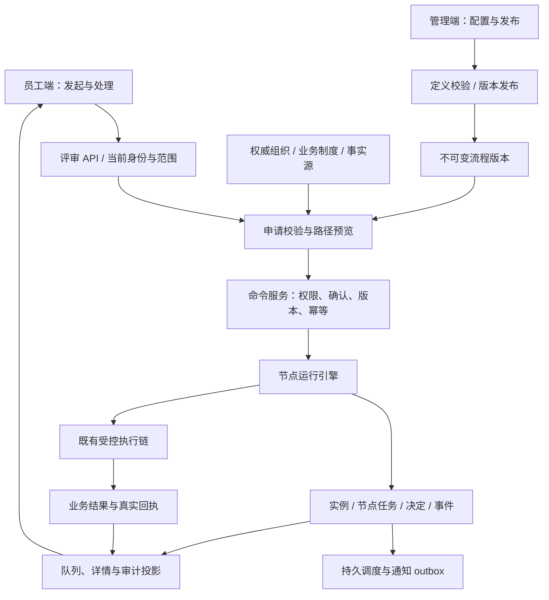

# 通用评审流程平台概要设计

版本：v0.1 · 日期：2026-10-04 · 状态：概要设计；已补充[详细设计](2026-10-04-generic-review-flow-detail.md)与[实施验收计划](../plans/2026-10-04-generic-review-flow-implementation.md)，应用代码待实施。

依据：用户需求“员工可发起评审、管理端可新建流程、流程可拖拽配置、不局限于费用”；现有工作区与附件的实现差异见[审批 v2 评审报告](2026-10-04-approval-v2-review.md)。本方案不修改现行法规，不代表生产能力已经交付。

## 1. 产品目标与设计决定

建设一套可配置的评审能力：管理员定义并发布流程，员工选择有资格使用的流程发起申请，评审人处理节点任务，系统保存决定、过程及回执。

产品层统一称“评审流程”，节点可以承担审批、审核、征询或办理等职责；代码中的 approval 命名可继续兼容，具体决定含义由模板明确。不能把所有评审通过都解释为付款、外发或正式阶段变更。

核心决定：

1. **模板、版本、实例分离。** 一条模板可有多个不可变发布版本，一次申请产生一个引用确定版本的实例。
2. **表单、流程、范围、业务结果一起配置。** 拖拽图只是完整定义的一部分。
3. **引擎执行机制，业务包提供规则。** 金额档、CEO 终审、品牌、汇率、人员和期限不写死在平台内核。
4. **审批决定与业务执行分离。** 通过可仅形成评审结论；需要后续动作时走既有受控执行链。
5. **后端唯一判定。** 前端消费允许动作、候选人员、预览结果与状态，不自行计算权限或审批链。
6. **基于现有系统演进。** 保留 React/TypeScript、Hono、既有持久化及调度设施，不引入第二套 Agent 推理循环，不在本轮更换技术栈。

## 2. 用户与权限

| 角色 | 操作 | 权限边界 |
|---|---|---|
| 发起人 | 选择流程、填表、预览、提交、查看自己的申请，按规则撤回或补充材料 | 可发起范围不等于全部业务数据访问权；代申请需明确授权 |
| 评审人 | 查看分配给自己的材料，作出决定，按规则转交或加签 | 当前任职、对象范围与节点资格均须成立 |
| 抄送人/征询人 | 查看被授权材料、接收通知或提交意见 | 不自动获得决定权 |
| 办理人 | 完成指定事项并提交证据 | 完成任务不等于批准整单 |
| 流程管理员 | 新建模板、编辑草稿、试运行、发布、停用新发起 | 管理权限不授予业务审批权；发布权和业务规则制定权分开 |
| 业务规则负责人 | 明确制度、角色资格、适用范围、例外和生效版本 | 平台承载其已发布规则，技术实现不自行补齐业务口径 |

沿用既有组织与权限体系，不另建孤立人员库。审批角色通过结构化任职记录表达：角色、稳定人员 ID、公司/组织/业务范围、生效期、来源、版本。流程节点引用记录并显示解析依据。

无需为了形式单独增加“角色授权页”。先复用组织治理能力，节点中提供角色/人员选择与来源跳转；若现有治理面无法维护任职范围，再补相应管理面板。

员工手动发起与处理是明确的受控动作入口，不隐式创建 Agent 对话。Agent 可以协助填表、解释与分析，不代替人作审批决定。经 Agent 发起的调用另须校验 Agent 使用资格及其已装配技能。

## 3. 员工端功能与交互

保留 `/approvals` 作为员工入口，默认回答“哪些单需要我处理”。

| 页面/区域 | 内容 | 主操作 |
|---|---|---|
| 评审工作台 | 待我处理、我发起的、已处理；搜索与类型/状态筛选 | 当前选中单据的处理入口；新发起为辅助入口 |
| 发起流程抽屉或子页面 | 有资格发起的已发布流程，按业务分类查找 | 选择流程后进入填写 |
| 申请表单 | 动态字段、附件、关联业务对象、申请人及范围 | 检查申请 |
| 提交确认 | 规范化内容、实际路径/人员、规则版本、风险及结果说明 | 确认提交 |
| 实例详情 | 申请材料、当前责任人、期限、节点过程、决定与回执 | 服务端允许的当前动作 |

主要路径：选择类型 → 填写材料 → 服务端检查和预览 → 确认提交 → 实例回执。预览为 L2；正式提交及其他生效动作按风险与确认契约执行。

表单编辑后旧预览失效；重复点击、断线重试复用同一提交幂等键。失败保留输入，提交结果不确定时查询原命令状态，不盲目创建新实例。

详情分层：先展示业务摘要和待处理事项，再展开完整表单、流程轨迹和审计。费用显示金额/币种/汇率依据；内容评审显示具体内容版本；其他类型不出现无关金额栏。

同意、驳回、退回补充、撤回、转交、加签各自使用独立动作与确认文案。是否开放以及理由是否必填来自模板和上位业务规则，不能默认对所有流程开放。

## 4. 管理端功能与交互

保留 `/admin/approval-types`，面向用户可命名“评审流程”。类型列表进入单条模板详情，提供四个页内面板。

| 面板 | 配置内容 | 校验重点 |
|---|---|---|
| 基本信息 | 名称、分类、说明、业务负责人、治理权限、发起范围、资料可见范围 | 使用范围、治理权限和业务数据范围分别表达 |
| 申请表单 | 字段及校验、附件、业务对象引用、条件显示、条件必填 | 字段 ID 稳定；服务端执行校验；敏感字段权限 |
| 评审流程 | 拖拽节点、分支、参与人、时限、异常与接管规则 | 连通性、支持能力、人员资格、规则来源 |
| 验证与发布 | 样例试运行、错误定位、版本差异、生效设置、发布记录 | 测试内容与发布内容同一 revision/hash |

草稿持续显示“未保存/已保存/验证过期/验证通过”；已发布版本只读，点击“创建新版本”复制为下一版草稿。停用仅阻止新发起，不默默取消运行中实例。

编辑阶段主 CTA 为保存草稿；满足发布条件后主 CTA 为发布，其他操作降低强调。列表与画布切换使用辅助选中态，不使用实底主按钮。每一视口最多一个实底主 CTA。

## 5. 通用表单与流程设计器

### 5.1 表单模型

首批字段：单行/长文本、数字、金额+币种、日期/日期区间、单选/多选、人员、附件、业务对象引用。每个字段具有稳定 key、标题、类型、必填、校验、展示条件及数据来源；重复明细表作为后续扩展，不伪装为已支持。

数字字段与“费用金额”不天然等价。费用模板显式绑定 amount/currency，内容模板绑定 content_version，合同模板绑定 contract_ref/version。字段 schema 在前后端共享，后端校验为最终依据。

条件分离 `form.*`（用户输入）、`system.*`（身份与系统计算）、`business.*`（经授权获取的事实）。输入不能覆盖系统金额、身份或业务范围。费用汇率及制度来自业务指定来源，带时间和版本。

附件保存为受控文件引用及版本，不用文本输入冒充上传；读取与下载检查当前实例和字段权限。

### 5.2 节点模型

| 节点 | 职责 | 主要配置 |
|---|---|---|
| 开始 | 定义申请进入流程 | 表单版本、申请范围、前置条件 |
| 人工评审 | 接收人的判断 | 参与人规则、决定方式、材料权限、允许动作、期限 |
| 条件分支 | 根据明确条件选择路径 | 有类型约束的条件、顺序/互斥规则、默认出口 |
| 抄送/征询 | 传递材料或收集意见 | 对象范围、收件人、是否等待意见；不隐式授予批准权 |
| 办理任务 | 完成业务事项 | 责任人、完成条件、证据、期限与接管 |
| 受控执行 | 执行已登记业务动作 | 已发布业务能力引用、字段映射、风险、授权、确认与回执 |
| 结束 | 形成流程结果 | 明确的结果语义与后续说明 |

首版采用可校验的有向无环流程图：每次条件分支选择一条明确路径，默认分支必配；允许同一节点内多人会签/或签，不扩展为任意并行分支与汇合。退回补充通过显式修订机制处理，不靠任意回边实现循环。

同一评审节点可配置单人、会签（全部满足）、或签（一人满足）、依次处理。拒绝是否立即终止、未处理任务如何关闭、人数变化如何处理等必须在业务模板中明确，缺项不发布。平台不暗中把四种方式都执行为串行链。

审批人规则支持：指定人员、业务角色、组织上级链、前序节点参与人、受限制的发起人选择。预览显示“解析结果+依据”；缺人、同一人重复、自批、代理、离职等按已发布规则阻断、重派或接管，不硬编码自动放行。

### 5.3 画布与列表共用同一状态

画布布局为节点库、流程画布、属性面板；窄宽度下属性面板改抽屉并保留等价列表编辑。节点显示业务名称；技术 ID 留在高级详情。

画布、属性面板、列表、撤销重做共享一个 FlowDocument 状态。操作采用添加节点、修改属性、连接指定分支、删除边等语义命令；一次拖动记录一次历史。边以 branch_id 标识，不按目标节点或“是/否”文案猜测。

支持点击添加、选择起终点连接、键盘操作和触摸操作。自动布局只改变 layout，不改变执行逻辑。颜色、尺寸和设备适配按 DESIGN；具体 UI 验收沿用其宽度×高度×输入模态矩阵。

## 6. 架构与执行边界

业务扩展通过已登记、版本化的字段来源、组织解析规则和动作契约接入。管理员选择业务能力，不在表单里输入任意 URL、脚本或原始 MCP 工具。知识库/MCP/API 仍遵守既有技能与 Gateway 路径，模板配置不能形成直连旁路。

预览与提交使用同一解释器；预览不产生正式副作用，返回规范化输入、人员/路径、依据版本及内容摘要。提交验证摘要、当前授权和配置是否仍适用。事实不足时展示缺口，不以默认零值或首个人员补齐。

正式命令的状态更新、决定事件及待投递任务在事务中提交。后续外部动作按稳定 action_id 和幂等键执行；结果不确定时核对回执，不能重跑整个申请。

## 7. 核心数据与状态

| 数据对象 | 关键内容 |
|---|---|
| ReviewTemplate | 稳定 ID、业务分类、负责人、适用范围、当前发布版、启停状态 |
| ReviewDefinitionVersion | 表单、流程图、规则引用、业务结果契约、版本、内容 hash、发布证据 |
| ReviewDraft | 基础版本、草稿 revision、编辑内容、保存状态 |
| ReviewInstance | 模板版本、发起人、对象范围、表单快照、申请修订号、依据版本、总体状态 |
| NodeInstance | 稳定节点 ID、激活时间、解析规则与结果、节点状态、assignment revision |
| ParticipantTask | 人员、职责类型、当前资格、任务状态、期限、决定权限 |
| ReviewDecision | 操作者、决定、原因、材料版本、节点版本、时间、授权依据 |
| Execution / Notification / Timer | 独立状态、重试/去重键、回执、错误、取消与接管信息 |
| CommandReceipt / Event | 命令作用域、幂等键、内容 hash、结果、状态迁移与审计事件 |

申请状态建议表达：草稿 → 评审中 → 已通过 / 已驳回 / 已撤回；允许补充材料的流程可进入待补充。异常节点保留阻断原因与接管入口，不冒充整单通过。

“待我处理”是当前任务投影，不是实例总体状态。多人节点分别记录各人的待办和决定，不能只用 current_index 表达全部情况。

后续执行状态独立：不适用 / 待执行 / 执行中 / 成功 / 部分成功 / 失败 / 结果待核对。纯评审通过可以结束；有后续动作时不得提前显示业务执行完成。

涉及材料实质修改时创建申请修订。旧决定保留并标明覆盖版本；哪些节点必须重审由业务规则规定，未定义则阻断继续决定并交接处理，不能默认沿用原批准。

流程定义冻结不等于人员授权冻结：运行中实例沿用原定义，但每次读取和决定仍检查当前人员资格与范围。

## 8. 接口概要

保留现有 `/api/approvals` 与 `/api/admin/approval-types` 路由体系，新增能力通过版本化契约扩展，旧端点以适配层兼容。

| 接口能力 | 核心契约 |
|---|---|
| 查询可发起流程 | 只返回当前身份允许使用的发布版本及表单 |
| 创建/保存申请草稿 | 当前身份、对象范围、表单版本、草稿 revision |
| prepare / preview | 规范化表单、合法路径、候选或实际参与人、规则/组织版本、确认摘要 |
| commit | 确认摘要、expected_version、幂等键；返回唯一实例与命令回执 |
| 决定/撤回/转交/加签/补充 | 独立动作 ID、材料版本、实例/任务版本、理由与幂等键 |
| 队列/详情 | 当前范围内数据、allowed_actions、eligible_assignees、后果说明、状态及回执 |
| 创建模板/修订草稿 | 管理权限、基础版本与草稿 revision；拒绝并发覆盖 |
| 校验/试运行/发布 | 同一内容 hash、规则依赖、覆盖样例、校验结果及发布记录 |

未知字段、非法金额/币种、缺失人员、未支持节点、过期预览和版本冲突返回明确错误码与恢复方式。幂等键按公司、操作者、动作作用域隔离；同键同内容重放结果，同键异内容返回冲突。

## 9. 超时、通知与异常

模板配置节点时限、提醒与升级策略；它们引用已发布业务授权，不把 48 小时或升级到 CEO 作为平台默认事实。

计时事件绑定实例、节点实例、assignment revision 和策略版本。持久调度器领取任务后复核当前状态；旧节点/旧人员分配的任务作废，不得转交新节点。升级保留原历史并按策略创建下一计时事件。

提醒采用持久通知任务，区分待投递、已投递、失败；只写 reminded 标志不算完成通知。没有合法升级目标、授权失效或外部结果不确定时进入接管，保留原因和处理入口。

首版不默认开放“超时自动批准”。未来只有明确业务授权、可验证条件和相应执行契约齐备时才作为受控能力开放。暂停/取消后保留已发生决定和外部回执。

## 10. 现状复用与迁移

| 现有资产 | 处理方式 |
|---|---|
| Approvals.tsx | 保留入口与队列能力，拆出类型选择、动态表单、确认与实例详情；消除费用专用分支 |
| ApprovalTypes.tsx | 演进为模板与版本工作台，复用四类配置内容，增加下一版草稿与发布差异 |
| FlowDesigner | 复用 SVG 呈现和布局思路，修正单状态源、分支身份、历史记录、输入模态 |
| flow-engine.ts / flow-types.ts | 演进为共享定义校验、纯预览与节点运行契约，取消把图直接压成 chain[] |
| plan.ts / policy.ts / snapshot.ts / org.ts | 费用计划改为业务模板适配；组织与制度改用权威配置，隔离测试快照 |
| queue.ts / inbox.ts | 复用投影方式，按 participant task 和当前权限取数；通知与超时复用同一范围约束 |
| gateway/wecom.ts | 分离审批命令与通知通道；复用可验证的版本控制部分，修复幂等、资格和回执边界 |
| timeout.ts / cron handler | 复用持久任务入口，改为节点版本计时与完整处理器契约 |

附件不是当前分支的完整替代版本。先按差异选择性迁移，不整包覆盖。

已有运行单据走 legacy 适配，保留原始 chain、payload、材料和决定；不自动按新流程重算。费用模板迁移时先核对现行制度，再验证新旧入口解释同一规则。旧入口最终调用同一命令服务，避免长期双引擎。

## 11. 实施范围与里程碑

| 阶段 | 交付范围 | 验收重点 |
|---|---|---|
| M0 契约与业务口径 | 明确支持节点/字段、角色来源、制度与异常规则，完成数据/API 详细设计 | 不确定规则有责任人和状态，不以代码默认值补齐 |
| M1 通用发起与安全提交 | 模板/版本/实例、动态表单、权限、预览确认、幂等命令 | 至少费用和一个非费用模板共享同一入口；重复提交唯一；越权拒绝 |
| M2 真实节点运行 | 单人/多人评审、分支、抄送、办理、时限与接管 | 各模式执行语义正确；陈旧任务无副作用；状态和回执可恢复 |
| M3 设计器与发布 | 单状态画布/列表、属性编辑、图校验、试运行、版本发布 | 所见/所测/所发同版本；空图/循环/断引用不能发布 |
| M4 业务扩展与验收 | 受控动作适配、历史单兼容、通知集成、体验矩阵与灰度 | 审批通过不冒充外部成功；旧实例保留证据；真实验证与模拟验证区分 |

M1–M3 才形成用户要求的“管理员配置发布、员工发起处理”的基本闭环。未完成的字段、节点和模式不能以可发布选项暴露。任意并行分支/汇合、子流程、脚本节点和完整 BPMN 兼容不列入首版。

费用、内容评审等模板可以验证通用机制，但具体金额档、财务流程、内容判定依据和批准后的业务后果仍需各自业务负责人发布；示例不能自动变成生产规则。

## 12. 合规审查与待定业务事项

| 需求 → 主责角色 | 宪法 → 基本法 | 结论与证据 → 下一步 |
|---|---|---|
| 通用配置与员工发起 → 平台产品经理、架构师 | CONST-01/02/04；PROD-PLAT-01/02/03/05；TECH-ARCH-03/04 | **符合**：以模板承载业务，平台不固定费用/人员口径 → 详细设计共享契约 |
| 拖拽及动态表单 → UI/UX、前端 | CONST-04/07；TECH-FE-01/03；DESIGN | **符合**：编辑与呈现消费同一后端定义，权限不在前端重写 → 组件与设备矩阵验收 |
| 审批授权与正式副作用 → 业务专家、后端 | CONST-03/05/06；BIZ-02/03/14/15；TECH-BE-01/02/03/08 | **符合**：身份、范围、确认、版本、幂等与真实回执统一校验 → 修复已有实现差距 |
| 超时与恢复 → 后端、测试经理 | CONST-05/10；PROD-PLAT-06；TECH-BE-04、TECH-TEST-02/03 | **符合**：明确服务身份、持久计时、旧任务失效与接管 → 故障恢复验证 |
| 自批/代理/多人否决/退回重审/超时授权 → 业务专家 | CONST-04/08/09；BIZ-14/15 | **规则空白或冲突**：当前缺完整且统一的适用口径 → 发布业务策略；只阻断依赖项启用，不阻断通用框架实施 |

本轮设计无需修改宪法。需要业务负责人补充的事项包括：谁可制定/发布具体业务模板；哪些类型必须经过哪些角色；自批与代理例外；会签/或签拒绝与未完成任务语义；撤回、转交、加签与退回权限；材料变更后的重审范围；时限、通知和升级授权；各类型通过后是否还有受控业务动作。

这些事项应落实为有来源、有责任人、有生效版本的配置。本概要设计不代业务负责人填写具体制度值。
