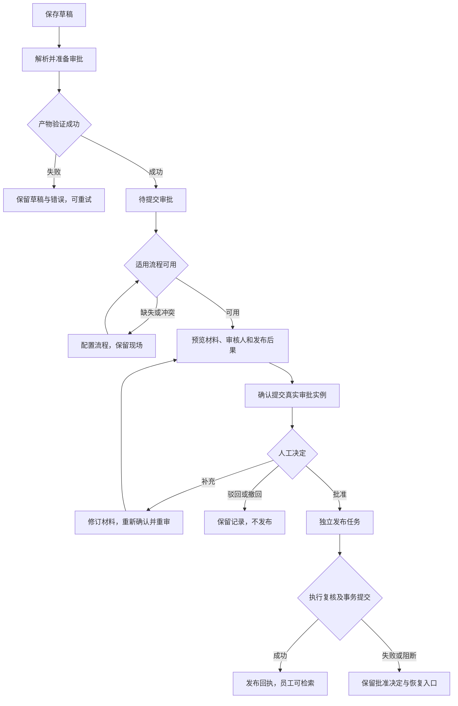

# 知识资料审批与发布详细设计

日期：2026-10-05。状态：PDF 首版已实现并完成定向验证；尚未部署或进行线上授权审批发布验收。本文不修改宪法与基本法，不代表线上闭环已交付。

## 1. 目标与审查

让知识治理形成可追溯闭环：保存草稿 → 解析与索引 → 提交真实审批 → 审批决定 → 发布执行 → 员工检索。界面应明确回答：资料处理到了哪里、当前由谁处理、下一步是什么、为什么尚未可用。

| 需求 | 主责角色 | 宪法条款 | 基本法条款 | 结论与证据 | 下一步 |
|---|---|---|---|---|---|
| 保存、解析、提交、批准、发布分别可追溯 | 平台产品经理、后端专家 | CONST-03/05/08/10 | PROD-PLAT-04/05、PROD-AGENT-09、TECH-BE-02/03/04 | 符合；草稿不生效、正式提交需确认、发布必须有回执 | 实现知识对象与通用审批适配 |
| 使用现有审批功能，不建立知识专用审批引擎 | 架构师、后端专家 | CONST-02/03/04 | TECH-ARCH-03/04、TECH-BE-07 | 符合；已有 v2 预览、命令与实例代码可复用，知识发布执行尚需新增 | 先验证审批引擎运行能力，再接入 |
| 原件、索引与审批绑定不可变版本 | 后端专家、测试经理 | CONST-05/06/10 | TECH-BE-01/03/08、TECH-TEST-02/03 | 符合；旧批准不覆盖新资料，参与审批不自动获得整个库的访问权 | 增加版本快照、范围校验及竞态测试 |
| 状态、恢复入口与使用/治理分离 | UI/UX 专家、智能体产品经理 | CONST-04/07 | PROD-AGENT-03/09、TECH-FE-01/03 | 符合；页面消费后端状态与 allowed_actions，不自行推断审批权限 | 按 DESIGN 实施并验收 |
| 实际审核人、自审、会签及审批期限 | 知识业务规则负责人、流程管理员 | CONST-04/05 | PROD-PLAT-05、TECH-BE-02 | 规则空白；现行规则未指定知识审核人员，不据此阻塞设计与解析 | 配置责任人与正式流程，依赖这些决定的正式提交保持阻断 |

规则依据：[宪法](../../CONSTITUTION.md)、[产品基本法](../../PRODUCT.md)、[技术基本法](../../TECHNOLOGY.md)、[组织与权限](../../org-permissions.md)、[工具契约](../../07-mcp-data-contract.md)、[信息架构](../../ia-information-architecture.md)、[设计实施细则](../../DESIGN.md)。通用审批接口设计参考[概要设计](2026-10-04-generic-review-flow-overview.md)和[详细设计](2026-10-04-generic-review-flow-detail.md)；其历史“待实施”描述不能代替当前代码核验。

## 2. 已核实的现状与差距

### 2.1 当前产品资料

2026-10-05 本次线上只读核验：

- 库：产品规格，`kbase_546516e4dbc4`，有效非结构化库。
- 文档：`kdoc_1882a5d729f0`，NETC-50160116-A5-102储能型产品规格书。
- 规整完成：北京时间 09:51:43；索引完成：09:52:08。
- 引擎记录为 completed、retrieval_ready=true，实际 pages.json 有 16 页。
- 文档为 pending_review，published_at 为空。本次没有启动解析、创建审批或发布。
- 数据库 artifacts 中 pages=0、engine_version=unknown 与引擎产物不完全一致。审批预检应核对实际产物并修正展示元数据，不能用这些字段单独判断解析失败，也不能伪造版本号。

### 2.2 代码事实

| 部分 | 当前实现 | 差距 |
|---|---|---|
| PDF 草稿与解析 | upload/start、规整、PageIndex 索引与作业记录 | 解析完成直接进入 pending_review，未区分待提交和审批中 |
| PDF 发布 | publishDocument 要求管理员、pending_review 和加工记录，直接写 published 并审计 | 没有关联真实审批实例、批准快照或统一发布回执 |
| 员工问答 | knowledge.ask_documents 仅查询 published 文档 | 缺资料时应提供符合权限的恢复说明；不得暴露未发布内容 |
| 通用审批 v2 | prepare、commands、模板版本、实例、材料修订、通知与超时处理代码已存在 | 知识资料对象引用与批准后的发布执行适配尚未接入；线上能力需单独验证 |
| 前端知识治理 | 多处管理员发布按钮，DocumentRail 有开始解析入口 | 入口需统一至真实审批；不能仅把按钮文字改成“审批” |

主要实施资产：backend/src/host/knowledge-documents.ts、backend/src/runtime/document-knowledge.ts、backend/src/routers/knowledge.ts、backend/src/approval/review-service.ts、backend/src/routers/reviews.ts、frontend/src/admin/knowledge/DocumentRail.tsx、ReviewView.tsx、IngestView.tsx。路径仅登记资产，不作为规范依赖。

## 3. 产品决定

1. 保存草稿仅保存，不自动解析、提交审批或发布。
2. 对 PDF 提供“解析并准备审批”。它启动加工，成功后到待提交审批；不创建审批单。
3. 解析前即可检查流程配置，提前提示缺失；缺流程不阻止上传、保存和解析。
4. 提交前，发起人查看原件、解析预览、实际流程、审核人、发布范围及批准后的结果，再确认提交。
5. 正式提交复用通用审批。相同资料版本同一时间只能有一个有效审批实例。
6. 首版推荐“批准后自动发布”：流程发布配置与提交确认均明确声明此结果。批准和发布保留独立状态与回执。
7. 可兼容“批准后手动发布”模式；这是流程配置，不允许申请人临时选择来绕过已发布规则。首版不必开放两种模式的全部 UI。
8. 结构化知识条目可以复用相同发布审批类型；没有解析步骤时以条目校验完成作为准备条件，不强行启动 PDF 流水线。
9. 资料修改创建新版本；既有发布版本继续用于员工查询，直至新版本发布成功。显式停用旧版是另一项受控动作。

## 4. 状态模型与合法动作

### 4.1 三条独立状态轴

不要继续在一个 status 字段里混合文件加工、人工决定与生效结果。

| 状态轴 | 状态 | 说明 |
|---|---|---|
| processing_status | draft / queued / normalizing / indexing / ready / failed / cancelled | 是否准备好待审资料；ready 要有实际可验证产物 |
| review_status | not_submitted / in_review / awaiting_amendment / approved / rejected / withdrawn | 审批实例与决定；没有实例不能显示 in_review |
| publication_status | unpublished / awaiting_release / queued / publishing / published / failed / blocked / archived / superseded | 是否已对员工生效；批准不等于发布 |

文档逻辑对象维护 current_draft_version_id 与 active_version_id；以上三轴属于具体版本。可以同时显示“线上 v1 已发布；v2 审批中”，这描述两份版本，不能把 v2 的未生效内容混入员工检索。

### 4.2 主状态由后端投影

| 当前条件 | 用户主状态 | 主行动 | 恢复/辅助动作 |
|---|---|---|---|
| 草稿，未解析 | 草稿·尚未解析 | 解析并准备审批 | 预览原件、修改、受控删除 |
| 排队或加工中 | 排队中 / 解析中 / 建索引中 | 无 | 查看真实进度、取消 |
| 加工失败 | 解析失败 | 重试解析 | 展开原因、修改资料 |
| ready，未提交，有流程 | 待提交审批 | 提交审批 | 审核试算、修改资料 |
| ready，缺流程 | 待提交审批·未配置流程 | 管理员：新建审批流程 | 普通用户：联系管理员；可继续预览 |
| 已存在活动实例 | 审批中 | 有当前处理资格：处理审批 | 查看审批；允许时撤回 |
| awaiting_amendment | 待补充材料 | 补充并重新提交 | 查看意见与修订差异 |
| rejected / withdrawn | 已驳回 / 已撤回 | 修改并准备新申请 | 查看历史；禁止直接发布 |
| approved，自动发布尚未执行 | 已批准·等待发布 | 无 | 查看发布任务与原因 |
| approved，手动发布模式 | 已批准·待发布 | 有资格者：确认发布 | 查看已批准版本 |
| 发布失败或被阻断 | 已批准·发布失败 / 发布受阻 | 服务端允许时：重试发布 | 查看原因、按需配置或重新申请 |
| 发布成功 | 已发布 | 无 | 创建新版本、查看回执；停用为独立确认动作 |

“取消解析”不等于撤回审批，“撤回审批”不等于停用知识，“归档”不等于删除历史。

### 4.3 主流程

## 5. 审批流程配置与缺失处理

### 5.1 复用一种业务类型

注册 knowledge_publication 类型，涵盖 PDF 文档和结构化条目。流程可以配置资料专业审核、负责人审批等节点；具体人员、是否允许自审、会签/或签、期限与升级规则由知识责任人和流程管理员发布，平台不预置某个部门负责人或管理员为审批人。

匹配顺序建议：同公司明确库绑定 → 同公司知识类别绑定 → 同公司知识发布默认流程。同一层出现多个有效候选时返回冲突，不取第一项。首版匹配只需支持库绑定和公司默认；类别继承可后续开放。

每条绑定包含模板稳定 ID、范围、有效状态、版本、操作者与审计。新申请使用模板当前有效发布版本；实例冻结其实际引用版本。流程草稿、停用流程、人员不可解析、发起范围不符与审批系统暂停分别说明，不能统称“没有流程”。

### 5.2 没有流程时

展示：“尚未配置适用于此知识库的知识发布审批流程。资料已保存且解析完成，配置后可继续提交。”

- 有模板治理资格：提供“绑定已有流程”，没有适用模板时提供“新建审批流程”。
- 新建预填业务类型、当前库、返回地址；审核人留给管理员配置，不自动写死。
- 新建仍经过保存草稿、验证、发布、绑定；草稿模板不能被当作可用流程。
- 配置完成返回原资料详情，重新检查并保留申请说明；不自动提交。
- 没有治理资格：只显示联系管理员说明与已登记的责任人，不泄露其他模板与人员资料。站内申请配置入口可后续做，不在首版伪装成已有功能。

提交检查失败时保持 review_status=not_submitted，不创建一张无人处理的正式审批单。

## 6. 申请材料、版本与审核体验

### 6.1 审批材料

系统只读字段：公司、知识库 ID、资料逻辑 ID、版本 ID、名称、原件受控引用与 SHA-256、解析产物指纹、实际页数、引擎版本或未知标记、检索就绪证据、发布范围、现有生效版本、申请人和提交时间。

发起人填写：发布说明、变更摘要；新版本列出与生效版本的差异。生效日期如首版不支持定时发布，不提供可填写后被忽略的日期字段。

流程系统字段：模板与发布版本、审批实例与轮次、规范化材料 hash、组织/资格依据版本、批准后的动作类型及发布模式。客户端不可覆盖这些字段。

### 6.2 审核人看到什么

在已有审批详情中新增知识资料区域：

1. 先显示申请目的、所属库、版本和发布范围。
2. 提供原件与解析文本/目录对照、可点击的原文页码。
3. 提供单份待审版本的审核试算，明确“不参与员工问答”。
4. 新版本展示差异，旧版可在当前权限下查看。
5. 显示来源、页数、解析异常和试算结果。试算有引用与资料指纹；资料变化后旧试算标为过期。
6. 决策区域显示该节点允许的批准、驳回、补充、转交等动作及后果。不得根据管理员身份在前端补出批准按钮。

审核试算不强制每单花费模型调用；流程可配置是否要求试算证据、来源核验或其他检查。页数一致、产物存在和检索就绪是提交技术前置，内容正确性由审核责任人判断。

审批原件使用受控知识对象引用；不将大 PDF 强行复制到现有通用附件上传接口。该接口目前有较小上传限制，知识资料必须保留独立的受控文件读取适配。审批参与人只获得该实例对应版本的必要材料访问，不获得库级或 Agent 使用权限。

### 6.3 内容变化

- 提交后不原地覆盖被冻结的原件或索引。修改创建新版本。
- 技术重跑也可能改变解析内容；其产物 hash 改变时视为材料变化，不沿用批准。
- 退回补充走通用审批修订机制，记录新材料快照和审批轮次；首版对知识正文/原件/范围变化从头重审，不保留旧节点同意。
- 补充普通说明也按模板允许字段和修订规则处理，不能偷偷替换系统引用。
- 已批准但未发布版本若被替代、撤回发布资格或范围变化，发布受阻并要求重新确认/申请。执行重试仅覆盖同一已批准快照。

## 7. 发布执行与权限闸门

### 7.1 独立执行记录

通用审批产出 approved 决定，不在审批引擎中写知识表。知识发布适配器以事务 Outbox 接收终态事件，并为 knowledge.publish 建立可靠作业，绑定 tenant、文档版本、审批实例及轮次、批准材料 hash、发布政策版本和确定幂等键。

当前 v2 的 handler 节点属于人工办理，并非通用自动执行器。不能把新增发布能力伪装成已支持的任意执行节点；首版通过登记的知识适配器完成批准后执行。

### 7.2 自动发布的授权来源

模板发布前明确登记批准后动作、发布服务身份、数据范围、确认方式与恢复策略。提交确认写明“本版本审批通过后将发布到指定知识库，供获准使用该库的技能检索”；批准确认写明最终后果。

服务身份执行的是这次被确认且批准的具体版本，不继承管理员全量权限。缺有效服务授权或动作适配时，不允许发布声明可自动发布的流程。已经明确覆盖的同一版本自动任务无需再次人工点击发布。

### 7.3 每次执行复核

- 公司、库有效性、当前资料范围、对象和版本是否匹配。
- 当前治理与执行授权；审批决定是否有效，实例材料 hash 是否对应。
- 原件与索引产物是否存在、指纹一致、引擎可用且引用映射可验证。
- 是否已存在同一执行回执；若成功，返回原回执。
- 是否存在并发新发布、生效指针版本冲突、明确停用或资料归档。

复核通过后以 PostgreSQL 事务更新版本 publication_status、逻辑对象 active_version_id、旧版 superseded 状态，写发布回执和索引/缓存失效 Outbox。员工检索以服务端已提交生效指针为准；缓存不能继续把被停用版本当有效。

事务中的 active_version_id 使用预期版本比较。v2/v3 并发批准时先提交的发布成功，后一个冲突进入 blocked，由有权人员核对，不采用最后写入覆盖。

### 7.4 失败恢复

- 确定未提交的临时故障：持久重试，显示真实尝试次数和原因。
- 版本变化、库停用、授权撤销：停止自动重试，进入 blocked，说明对应恢复动作。
- 提交回执不确定：按幂等键查事务回执与生效版本，核实前不显示已发布、不盲重做。
- 发布失败保留 approved 决定；不要求用户重复批准同一未变化内容来修复基础设施。
- 索引/缓存传播问题单独展示，不撤销已提交的事实；读取端必须以权威生效状态过滤，未就绪时如实报告暂不可用。

通知复用站内通知与持久 Outbox，提醒审核人、发起人或发布恢复责任人。首版不新增邮件/企业微信外发，也不自动重跑产品咨询任务；发布后原任务提供“重新查询”入口。

## 8. 数据模型与接口契约（拟新增）

### 8.1 数据实体

| 实体 | 关键字段 / 约束 |
|---|---|
| knowledge_document_versions | tenant、document_id、version、source_ref/hash、artifacts_ref/hash、processing_status、review_status、publication_status、row_version；原件与产物不可变 |
| knowledge_documents | tenant、base_id、current_draft_version_id、active_version_id、row_version；对象级归属与生效指针 |
| knowledge_review_bindings | tenant、base_id 或默认范围、template_id、version、enabled、发布模式；同层唯一有效绑定 |
| knowledge_review_links | tenant、version_id、instance_id、round、material_hash、expected_active_version_id；版本活动申请唯一约束，保留历史实例 |
| knowledge_publication_executions | tenant、version_id、instance_id、round、状态、幂等键、授权/政策版本、attempt、错误、回执、时间 |

通用审批实例、决定、修订、任务与通知继续使用现有实体，不复制一套知识审批表。新数据访问采用原生 PostgreSQL 与版本化 migration，不新增同步兼容桥或 SQLite 路径。

### 8.2 接口边界

以下是设计接口，不宣称已经实现：

| 接口 | 职责与返回 |
|---|---|
| GET 知识版本详情 | 三轴状态、主状态、active_version、处理人、阻断原因、allowed_actions、审批与发布链接 |
| GET 知识库发布流程检查 | 唯一适用模板及版本、配置状态、当前用户可用的治理动作；仅返回获准范围 |
| POST 知识版本解析 | expected_version、幂等键；返回持久 job_id；不提交审批 |
| POST 知识版本审批预检 | 返回产物检查、规范化材料、适用流程与参与人；生成或映射通用 prepare 确认快照 |
| POST 知识版本审批提交 | 消费 confirmation_id、expected_version、幂等键；同事务创建通用实例、知识关联和提交回执 |
| 通用 v2 prepare / commands | 继续负责人工决定、撤回、补充、转交与其确认；通过知识对象适配复核受控材料 |
| POST 知识发布重试 | 仅对未变化已批准版本、有资格者、可重试错误开放；返回原执行或新尝试回执 |
| GET 知识审批材料 / 原件 / 试算 | 以 tenant、instance、round、version 当前资格检查；撤权后拒绝 |

知识提交由服务端装配系统字段，不能让调用者经通用 /commands 注入 knowledge_publication 类型、伪造批准关联或绕开知识 preflight。通用命令入口也必须调用同一对象适配器校验；两个入口没有权限旁路。

### 8.3 预检与提交

预检快照至少绑定操作者、公司、文档版本与 row_version、原件/索引 hash、模板发布版本、组织依据、材料、发布范围、模式与预期生效版本。确认项变化或确认过期则返回具名错误，保留填写内容重新预检。

提交加锁/唯一约束保护活动审批创建；确认消费、实例建立、关联记录、Outbox 与幂等回执在同一事务。相同键相同内容返回原实例，相同键不同内容返回冲突。刷新、双击、断线重试不产生第二张单。

错误按原因区分：流程缺失、模板未发布、流程冲突、审批暂停、审核人无法解析、资料未就绪、材料变化、权限撤销、已有活动申请、生效版本冲突、发布失败。员工显示可理解说明，技术码与详情仅在获准审计面展开。

## 9. 页面详细交互

### 9.1 知识治理页

沿用知识库列表 + 资料详情，不新增第二个审批待办页。

- 列表显示名称、版本、一个主状态、最后变更时间。选中后详情显示当前处理人、下一步与入口。
- 详情分为内容预览、加工情况、审批记录、发布与生效版本；次要技术内容折叠。
- 草稿保存回执：“已保存草稿，尚未解析和提交审批”；下一步为“解析并准备审批”。
- ready 回执：“解析完成，共16页；尚未提交审批”。流程缺失作为独立原因提示。
- 提交成功回执包含正式单号和直达该实例的链接，不能泛链到审批首页代替关联。
- 管理员原有“审批发布”直接写状态入口统一迁到审批提交/实例处理；服务端旧发布接口同步收口，不能只隐藏按钮。

### 9.2 提交确认

在适配宽度的紧凑弹窗或独立详情中依次展示：资料和版本 → 发布说明与差异 → 生效范围与替代旧版 → 流程及实际审核人 → 批准后的发布模式。

唯一实底主行动为“确认提交审批”，取消和返回编辑降低强调。缺必需条件时显示原因与恢复入口，不仅置灰。提交成功后详情保留，提供查看审批；配置流程后回到该资料，不丢现场。

### 9.3 审批与发布

审批工作台按 knowledge_publication 显示“知识发布”，不显示费用字段。在现有实例详情处理决定，知识管理页只引用该实例的当前阶段和处理人。

批准后页面即刻区分“审批已通过”和“发布执行中”。只有服务端发布成功回执才显示“已发布”。人工发布模式同样展示具体版本和生效范围确认，不允许编辑批准内容后继续发布。

### 9.4 产品咨询任务

本轮最小联动：只在有知识治理权限时提示“资料尚未发布”，提供当前资料或审批的受控入口；普通员工只说明“当前暂无可用的已发布资料”，不暴露待审内容和审批人。

知识问答为 L1，不因为空库生成 L3“待你确认”。查询结束后停止执行提示；缺资料属于结果受阻，并显示原因和重新查询入口。此任务状态投影涉及当前任务契约，需要独立适配，不将审批状态写入产品咨询任务。

### 9.5 视觉与适配

全部使用 DESIGN 现有 token、小字号、密集工作台布局；不新增色值、字号或间距。每视口最多一个实底主 CTA；状态有文字和形状；窄栏单列；长内容可展开；关键操作区可见；宽度/高度/输入模态分别验收。列表不再重复渲染完整摘要、卡片和状态。

## 10. 存量迁移与当前规格书路径

1. 盘点全部库、结构化条目、文档及活动审批；迁移先做 dry-run，输出数量和冲突。
2. 旧 pending_review 若没有真实审批实例，迁为 ready + not_submitted + unpublished，展示“待提交审批”。不得批量伪造审批中。
3. draft 保持未解析；已加工的资料核对实际产物。修复页数等可验证元数据，未知引擎版本继续标未知。
4. 已发布资料保留可追溯历史版本，来源标记 legacy_publication 并保存已有操作者/时间；不伪造批准单，不因本次迁移自动停用。按新政策需要补审的资料另外形成治理任务。
5. 存在真实关联的活动审批，冻结对应版本并验证材料一致；不能自动挂接同名或最近一张审批单。
6. 为现有规格书建立不可变待审版本，复用当前16页索引，经权限内审核试算后预检。流程缺失则进入配置提示；配置成功后由用户确认提交。
7. 只有真实批准且发布执行成功，才允许员工查询该版本。本设计请求不授权立即创建线上流程、选审核人、提交或发布。

切换旧入口与新入口需在同一发布窗口完成；迁移期间短暂阻断新增发布写入，保留读取、加工和审批历史。旧接口返回迁移后对应状态或明确的新流程入口，不能作为发布后门。回滚保留审批决定、发布指针与回执；不得回滚为允许绕过审批的旧写入口。

## 11. 实施阶段与验收

| 阶段 | 交付 | 退出证据 |
|---|---|---|
| P1 数据与契约 | 版本实体、三轴投影、对象适配、流程检查、确认提交、材料读取 | PostgreSQL migration dry-run、授权/幂等/版本竞态定向测试 |
| P2 审批与执行 | 真实实例联动、批准 Outbox、发布 Worker、回执、失败恢复、旧接口收口 | 审批批准与发布分离、重启恢复、撤权/范围变化、并发发布测试 |
| P3 界面与存量 | 详情、缺流程恢复、实例知识面板、现有规格书迁移、任务最小提示 | 管理端及审批 E2E、DESIGN 适配、线上只读核验 |
| P4 授权闭环验收 | 正式配置 → 真实申请 → 人工决定 → 发布 → 产品咨询引用 | 明确授权的资料/审核人/范围、真实审批与发布回执、真实 harness 和页码核验 |

关键验收用例：

- 保存草稿不解析、不建审批实例、不发布；解析成功不等于已提交。
- 无流程、未发布模板、流程冲突、审批暂停与人员缺失分别显示；配置返回原现场。
- 跨公司访问、无资料范围、伪造系统字段、直接调用旧发布接口、借管理员身份绕过批准均拒绝。
- 重复提交、迟到响应、确认后编辑、断线恢复均不产生重复单或错版本。
- PDF 大文件通过受控对象引用参与审批，不受通用小附件上限误伤，也不绕过文件鉴权。
- 审核试算严格单版本，引用可验证；模型或引擎失败如实显示，不伪造结果。
- 原件/产物/范围变化使旧确认或批准不再适用于新版本；审批修订保留历史轮次。
- 驳回、撤回、待补充不发布；批准后发布失败不把审批改成未批准。
- 重启、租约失效、重复终态事件仍只发布一次；并发 v2/v3 不覆盖新生效版本。
- 旧版在新版本草稿/加工/审批期间仍可用；新版本发布成功后查询只取有效版本。
- 停用、撤权、归档后详情、文件、试算、缓存、Agent 检索全部按当前范围拒绝。
- 同一规格书真实批准发布后，“有什么产品”必须返回来源支持的产品信息与正确页码；无法引用时不编造。

测试按受影响模块运行，区分模拟、真实审批、真实索引/模型和线上授权验证。设计稿、代码测试、合成 PDF 验证均不能代替实际规格书的审批发布验收。

## 12. 推荐采用的首版范围

优先交付 PDF 资料完整闭环、按库/公司默认流程匹配、批准后自动发布、原件与索引版本绑定、失败恢复和存量待审状态修正。复用通用审批已有节点与组织资格解析。

结构化条目复用对象契约与发布闸门；类别继承、定时生效、批量审批、复杂会签、外部通知和自动重跑原任务作为后续能力。当前平台若无法正确执行某种节点或发布模式，模板发布验证明确阻断，不以配置项存在冒充可用。

## 13. 本次代码实施与验证记录

### 13.1 实施范围

- PostgreSQL migration `024_knowledge_publication.sql` 增加库与公司流程绑定、文档版本、审批材料快照、审批关联和发布回执。旧 pending_review 没有实例时投影为“待提交审批”，不伪造审批中；存量 published 保留读取并标识历史记录。
- 使用现有 ReviewService 的真实预检、确认、幂等命令和人工决定。数据库触发器将真实实例关联与批准后的 ExecutionJob/Outbox 写入同一事务；发布 Worker 校验原件、索引、批准、权限、租约和当前生效版本，再原子替换版本及保存回执。
- 原件与实际 PageIndex 产物按哈希冻结；提交过的资料禁止原地改写、重加工或删除。未正式提交的预检可取消，不生成实例，也不阻碍删除未提交资料。
- 已批准后的故障、租约不确定状态保留审批决定，提供显式恢复。新版本草稿可以替换 PDF 原件，审核期间旧版继续检索；并发批准的版本不能覆盖已经更新的生效版本。
- 管理端资料详情统一承接配置流程、提交确认、恢复、新版草稿；旧直接发布接口返回明确错误。缺流程跳转预填的知识发布流程编辑器，返回原资料；系统字段结构固定。
- 审核者按真实实例参与关系读取冻结 PDF，并在当前单版本内试算、核对原件页码及查看发布回执。该入口不授予整库管理权限。
- 产品咨询空结果按草稿、解析、待提交、审批及批准未发布给出原因；不返回未发布正文、文件标识或审核人员。首次交付未改通用任务状态；续作中的中栏与右栏适配见 §14。
- 新增知识持久化、审计和发布操作使用原生 PostgreSQL；组织资格和通用评审调用复用现有权威服务。本次未新增 SQLite 能力或桥接数据模型。

### 13.2 定向验证证据

测试仅使用专用本机 PostgreSQL，按用例克隆隔离数据库，未写线上数据库或创建线上审批。

| 验证 | 范围 | 结果 |
|---|---|---|
| knowledge-publication.test.ts | 草稿/待提交、缺流程、伪造请求、绑定变化、确认取消、幂等、真实人工批准与 Outbox、文件冻结、权限撤回、审核 PDF 与试算、失败/不确定状态恢复、新版替换、并发版本冲突 | 13 个用例通过；最后新增的并发与数据库插入闸门另作定向复验 |
| knowledge-documents.test.ts 定向选择 | 草稿保存/解析、产品咨询发布前后与撤权、原文引用、单文档试算范围、删除/归档 | 5 个通过，其他 5 个未运行 |
| knowledge-publication.spec.ts | 缺流程与固定系统字段、确认/取消/失败重试幂等、恢复状态、审核原件/试算/回执 | 4 个浏览器用例通过；使用 UI 交互夹具，后端真实性由上述 PostgreSQL/HTTP 用例验证 |
| product-knowledge.spec.ts 定向选择 | 实际上传 PDF 草稿、独立解析与数据库状态 | 1 个通过；原复合用例拆分，未将不相关的 Agent 配置页面测试计入本次验收 |
| 类型与构建 | 前后端 TypeScript、前端生产构建、差异空白检查 | 通过 |

PageIndex 检索和模型输出测试使用明确的 stub；另用真实引擎产物格式验证“数据库页数为0、实际页面存在”和未完成产物拒绝。这些证据不等同于线上规格书的真实模型效果验收。

### 13.3 上线前仍需的授权工作

部署时应用 PostgreSQL migration，再由有资格的流程管理员配置并发布正式知识审批流程、绑定产品规格库。现有16页规格书可保留原索引进入预检，由用户确认提交，实际审核者决定后取得真实发布回执，再查询产品咨询结果。上述线上动作与结构化知识接入未因本次本地实现而自动执行；通用任务状态的本地改造见 §14。

## 14. 续作：任务运行与验收展示

审宪记录：需求为纠正只读查询结束后的中栏“正在处理”和右栏“待你确认”；主责为平台产品角色（运行与任务分离）、后端角色（真实状态投影）、界面角色（消费契约）、测试角色（局部验证）。依据 CONSTITUTION.md CONST-02/04/05/08/10，PRODUCT.md PROD-AGENT-03/08/09，TECHNOLOGY.md TECH-ARCH-04/FE-03/BE-01/TEST-01/03、DESIGN.md 状态不变量及 org-permissions.md 审批链。结论：符合；既有证据为成功运行写入 completed、正式任务仍 waiting，页面却一律映射确认，操作轨迹 inactive 后仍保留进行中标题。下一步：仅修正显示契约和收尾，不推进正式任务，不赋予权限或跳过确认。

后端通过原生 PostgreSQL 读取本任务最新运行，根据已注册技能的 side_effects=none 投影 result_ready。任务详情与按会话查询均返回该契约；没有完成证据不得推断只读完成。中栏与右栏消费同一状态：结果已生成、结果待验收、实际待确认分别呈现。运行摘要不再将只读结果误写成待确认。

操作调用轨迹结束后使用记录标题，未得到终态的调用记为中断，已失败调用保持失败；成功的模型运行不能证明所有工具成功。沿用既有知识缺资料原因，不新增员工面管理入口，不自动重查或发布。仅验证本节改动，部署仍未执行。

定向验证证据：task-execution-view.test.ts 2 个、runViewState.test.ts 5 个、tasks-runtime.test.ts 的真实 PostgreSQL/HTTP 运行用例 1 个、worker-progress.test.ts 中收尾和时间保留用例 3 个，共 11 个不重复用例通过；其他后端用例未运行。task-result-state.spec.ts 3 个浏览器状态夹具用例和 workbench.spec.ts 中实时推理展示回归 1 个通过。前后端类型检查、前端生产构建与差异空白检查通过。浏览器夹具只证明交互展示，实际状态契约由 PostgreSQL/HTTP 用例验证，真实模型检索效果与线上部署未纳入本轮。

## 15. 合并与部署审查

需求：用户明确授权合并、push、部署。主责：后端专家负责迁移与 Worker，前端专家负责构建，测试经理负责影响范围验证，项目经理负责版本和回滚证据。依据 CONSTITUTION.md CONST-05/08/10、TECHNOLOGY.md TECH-BE-03/09、TECH-TEST-01/03/04。结论：符合；已有本机定向测试和类型构建证据，部署前先合入最新 main 并解决冲突，保存生产数据库与现行版本备份，再应用迁移并保持 API/Execution Worker/Outbox 同版本。部署授权不替代知识文档的人工审批，不自动批准或发布现有资料。下一步：推送确切 revision，部署并验证服务健康、迁移账本、Worker 与版本。

合并后验证：纳入 origin/main 的 8ada26c，无冲突。26 个定向逻辑/接口用例通过、4 个任务页浏览器用例通过；全新隔离 PostgreSQL 库运行所有迁移及二次幂等运行通过，知识发布 13 个用例在新库复验通过。修正跨平台新 SQL 的换行规范化，并兼容主干新增的工具显示文案，结束后的失败调用明确标注“调用失败”。生产旧版本 bd1cb1c 的数据库与配置备份已保存于受限备份目录；备份时 1 份资料为 pending_review、0 份已发布。此记录只证明代码与发布准备，不代替线上资料审批或模型效果验收。

## 16. 审批流程 UUID 兼容性修复审查

需求：新建审批流程发布时 crypto.randomUUID 不可调用。主责：前端专家负责浏览器能力兼容，后端专家维持确认与幂等契约，测试经理验证缺少该 API 时的真实页面操作。依据 CONSTITUTION.md CONST-05/08/10，TECHNOLOGY.md TECH-FE-03、TECH-BE-02/03、TECH-TEST-01/03/04。结论：符合；useReviewCommand 在预检之后直接调用随机 UUID，HTTP 环境缺少该方法时无法打开确认框。同源的表单字段与流程节点创建也直接调用该方法。下一步：审批页面统一用平台原生 randomUUID 或 getRandomValues 构造 UUID v4；无安全随机能力时明确阻断，不用 Math.random；不变更审批权、发布确认和重试幂等契约。仅测试这一组调用，并按既有授权推送部署修复。

UUID 修复证据：browser-review-uuid.test.ts 3 个用例通过，覆盖原生 API 接收者、缺 randomUUID 时的 UUID v4、缺安全随机能力时明确拒绝；review-workflow.spec.ts 2 个浏览器用例在禁用 randomUUID 的环境下通过，分别覆盖普通流程及知识发布流程新建、节点/字段添加、草稿保存、取消发布确认无提交、正式发布请求、失败重试幂等键不变。前端类型检查与生产构建通过，差异空白检查通过。本次不变更数据库或线上审批决定；部署将更新前端资源及服务版本。
