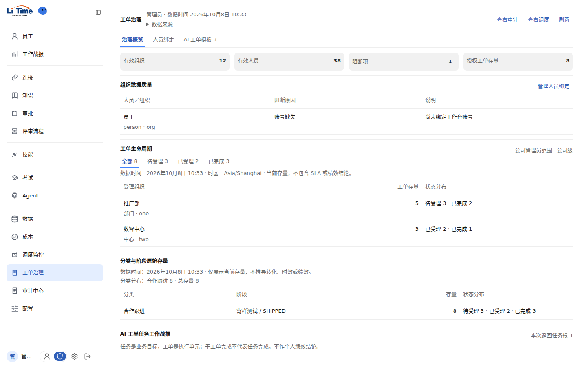
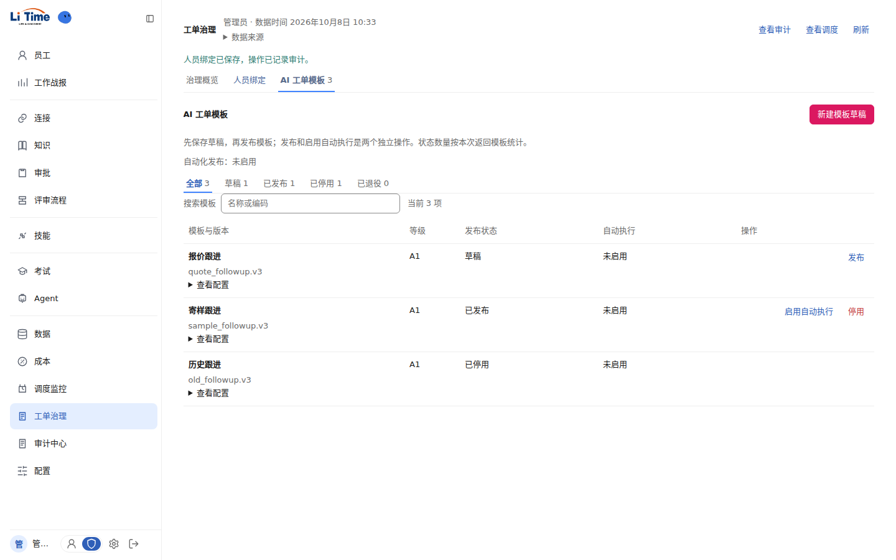

# 工单治理生命周期组件整改

基线：27efc8ef。用户确认补齐「基础 Token → 通用控件 → 业务组件 → 页面组合」的生命周期组件层，并采纳工单治理页评审建议。

## 审宪记录

| 需求 | 主责角色 | 宪法与基本法 | 结论与证据 | 下一步 |
|---|---|---|---|---|
| 建立生命周期导航与管理工作区，重构管理侧呈现 | UI/UX 专家、前端专家 | CONST-04/07/09；TECH-FE-01/03；DESIGN §4.3/19/25；IA §1/3 | 符合。组件只接收状态、数量和内容，不定义状态机与组织授权；管理端不新增接单/完成/阶段推进入口 | 将两个组件作为生命周期页面组合入口 |
| 失败与零值分离 | 前端专家 | CONST-06/10；TECH-FE-01/03；DESIGN §8/25 | 符合。七个接口分别维护读取状态，单一失败不丢弃其他读取结果；失败不给空态或零计数 | 验证错误恢复与无误报 |
| 正式绑定、发布、停用与执行开关确认 | UI/UX 专家、前端专家 | CONST-05；BIZ-14；TECH-FE-01；DESIGN §1/25 | 符合。复用既有确认组件；发布保留 expected_version，模板命令保留幂等键；授权与合法性由现有服务端判定 | 验证取消无写入和确认回执 |

## 实施资产

- LifecycleNavigation：视图 Tab 与集合状态筛选两种语义，统一视觉；键盘、计数、未知状态和禁用态可呈现。
- LifecycleWorkspace：固定标题、来源、回执和业务导航；单一内容滚动区，隐藏视图保留编辑上下文。
- AdminWorkOrders：治理概览 / 人员绑定 / AI 工单模板；组织工单状态筛选；模板状态筛选与搜索；发布状态/执行开关分列；按等级展示 A3；独立复选框样式。
- docs/DESIGN.md：v3.3 / §25；Token 登记重新生成，现有未定义项如实标记，不用补造变量掩盖缺口。

## 管理端页面设计

页面路径：`/admin/work-orders`。导航沿用「工单治理」，以生命周期工作区承载管理视图，避免在一个长页面中同时摊开报表和编辑表单。

| 管理视图 | 首要问题 | 默认内容与操作 |
|---|---|---|
| 治理概览 | 当前组织范围内的工单如何分布，有哪些治理阻断？ | 紧凑指标条、组织数据质量、工单生命周期筛选、组织与阶段存量、任务工作战报；阻断项导向人员绑定 |
| 人员绑定 | 哪个账号对应哪个组织人员？ | 账号与人员选择、绑定原因；提交确认和审计回执 |
| AI 工单模板 | 哪些模板处于哪个生命周期，哪些正在自动执行？ | 状态筛选与搜索、紧凑列表；发布状态和自动执行分列；新建草稿按需展开，A3 专属配置按等级呈现 |

视图 Tab 切换管理任务；第二层状态导航筛选当前集合。切换时保留筛选、搜索和草稿上下文。页面使用现有 DESIGN Token；主操作仅保留一个实底按钮，其余为文本操作。数据来源和技术诊断折叠，错误在所属区域给出重试入口。

以下为真实前端渲染截图，使用接口契约形状的测试数据，不代表生产存量。

## 验证与边界

- 前端 typecheck 与生产 build。
- 专项 Playwright：失败隔离与重试、导航/筛选/搜索保留、A3 条件配置、确认取消无写入、发布/执行独立、人员绑定与回执；1440/1024/390 布局检查。
- 截图使用契约形状的测试数据。测试没有访问生产 PostgreSQL，也没有在远程执行发布或人员绑定。
- 新组件引用的 CSS Token 均已有实际定义；登记表中历史未实现项仍是待落地事项。
- 本次不调整 PostgreSQL 并发/事务；原 serialization 错误只做正确呈现和恢复，不宣称根因已修复。
- 模板接口默认最多返回 100 项，Task 根默认最多 50 项，数量注明本次返回；全量分页是现有读模型缺口。
- 当前有效组织/人员没有对应明细下钻读模型，不虚构明细入口；正式权限与状态推进未改动。

## 本次执行结果（2026-10-08）

- `npm run typecheck`：通过。
- `npm run build`：通过。
- `PW_EXECUTABLE_PATH=/tmp/chromium npx playwright test --config=playwright.work-orders.config.ts`：5 项通过；测试浏览器路径为本次环境配置，不是应用依赖。
- `node backend/scripts/check-design-tokens.mjs`：登记一致，历史待落地项 27 个。新生命周期组件引用 Token 缺失为 0。
- 本地分支：`fix/work-order-lifecycle-workspace`；未推送、合并或部署。

## 合并复核（2026-10-08）

用户授权合并到 main 并 push。远程 main 核对为 `27efc8e`，与实施基线一致，无合并冲突；复跑生产构建和 5 项专项交互测试全部通过，DESIGN Token 登记校验通过。上述截图来自本次复核。

main push 会触发现有 `lingong-release-gate` 工作流；该流程门禁成功后自动进入生产部署。本地构建与专项测试通过，不等同于远程发布门禁或线上部署完成。
